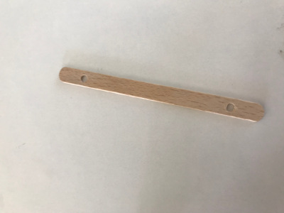
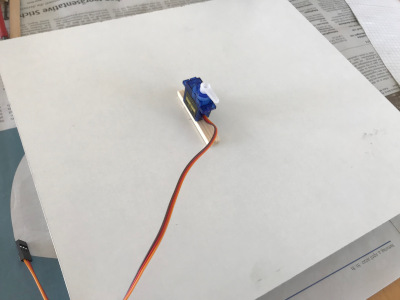
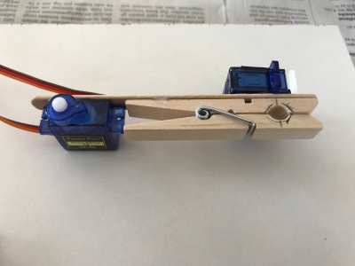
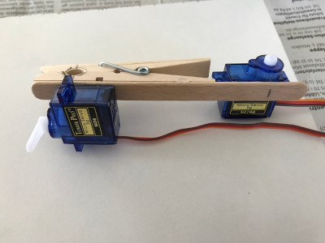
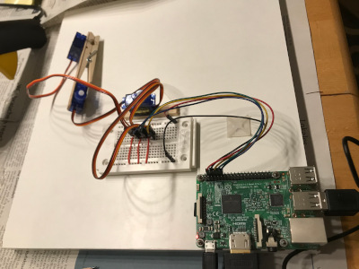
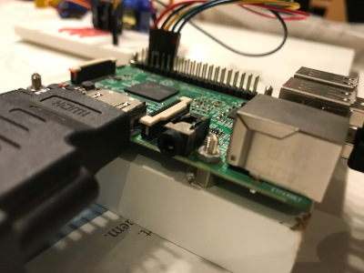
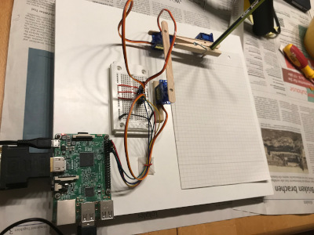
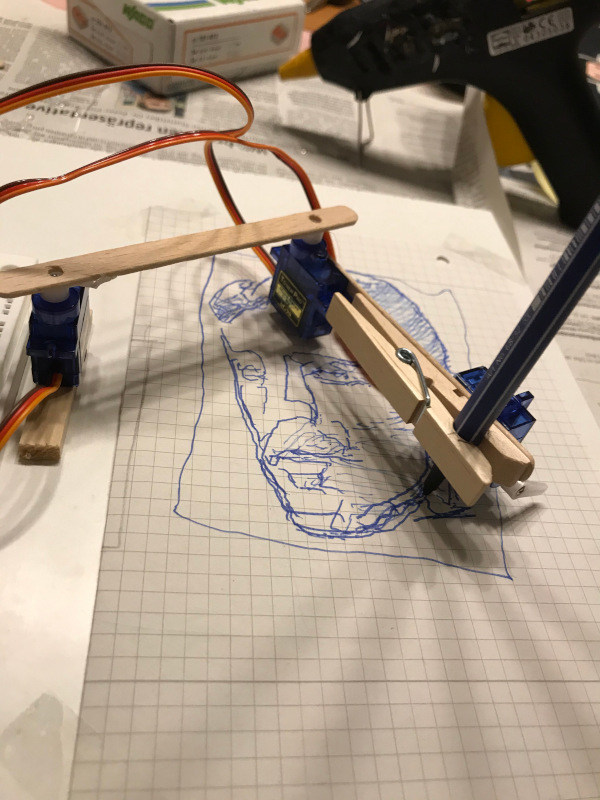
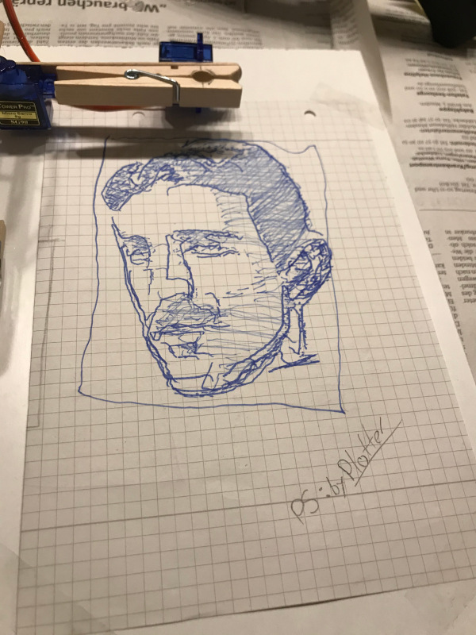

This is a small image tour of our building session for the brachiograph plotter...

  

    

    

    

    

    

    

    

  

  

  

The first job has started...

...and succeded with a great result. 😄

